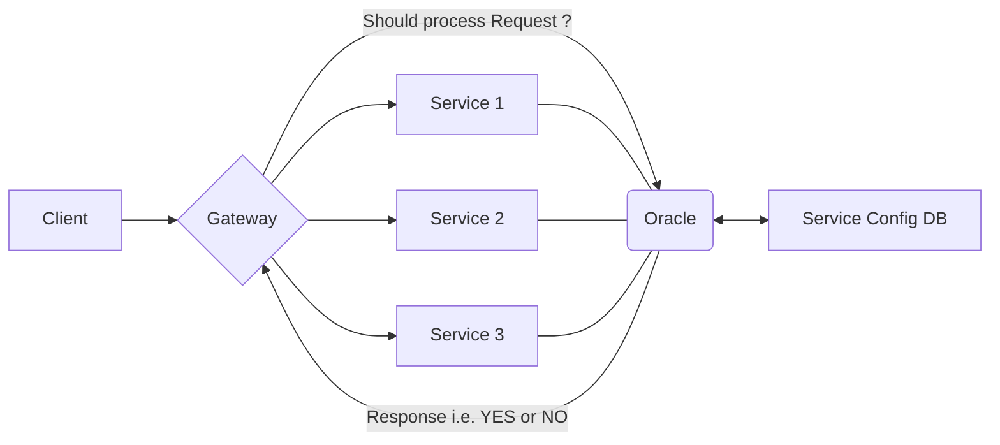
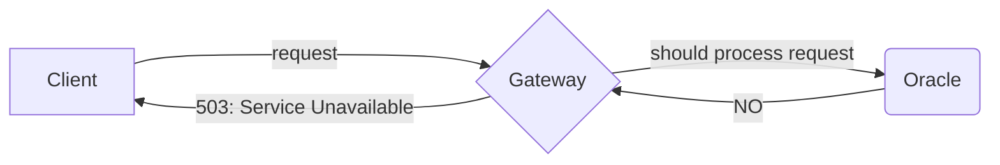

# System Design

## Basics

- [System Design Basics](https://www.youtube.com/watch?v=xpDnVSmNFX0&list=PLMCXHnjXnTnvo6alSjVkgxV-VH6EPyvoX)

## Fundamentals

### Databases: Deep Dive

#### Database vs Server

It is always better to have a separate application server to take care of the application logic thereby giving us flexibility to switch from one database to other.

#### Database vs File System

A file system which is very well structured and designed for constant reads/updates/insertions is essentially a database.

#### Can Databases be in-memory ?

Yes concept of in-memory databases do exist, but they are primarily used for caching purposes.

#### Storage and Retrieval

Algorithms used for storing data:

- In relational DB, B+ Trees are used (or log-structured merge-tree).
- Pages
- Hash Tables
- Pointers.

It is always easy to move from one database to other rather than looking deeply into one database and exploring performance issues.

How do databases read data ?

- B+ Trees they form something called "Indexes" to something called "Rows of structured data".
- Strucutured data is universally acceptable conceptually as it has standard data types for each column rescpectively.
- Hash Tables are basically meant for Faster lookups along with B+ Trees.
- There are foreign keys in this table which use pointers.

General structure of an SQL query:

```sql
select * from [TABLE_NAME] where [CONDITION] group by [COLUMN_NAME] having [AGGREGATION] order by [COLUMN_NAME] limit number;
```

**Query Optimizer** within the DBMS will look at this query and will find the most optimal way to exectue this query internally because we as developers don't know where the indexes are and how the data is stored.

#### What is a NoSQL database ?

- NoSQL databases are **document oriented databases** which store data in key-value pairs.
- Have gained a lot of popularity recently as they provide additional benefits.
- May not always be the go-to choice.
- Examples: MongoDB, ElasticSearch.

#### Are databases a single source of truth ?

- Yes Databases are expected to provide consistent data or the data which is as consistent (as recent) as possible.
- They are also responsible to be available for every incoming request.

#### What is a Database Management System ?

- Decide how and where any data is to be kept.
- Configurations when storing the data.
- Helps with read replicas and coordination in the system.

Think of a DBMS like a Manager and Employees as Tables. The manager will make sure that each employee will store the data only that they are authorized to store.

#### Graph Databases

- Stores data internally as nodes and edges.
- Used to perform graph queries efficiently.

#### Time-series DB

- Stores data that are part of time-series. Ex: No. of sales happening on per hour/day/month/year basis.
- Aggregate and compress time-stamped data.
- Since, relational databases are extremely flexible and thus, there are few time-series DB are written on top of relational DB.

#### Object Oriented databases

- Designed to work with complex data objects (Tuples).
- Are usually implemented using Relational DB. So this is simply abstration to Relational DB to write and read data quicker.
- _Limitation_: Should only go for it when is absolutely necessary and relevant to our use-case.

#### What database should you choose ?

Every database has its own trade-offs so we can either have an alternative solution in hand or go for some database that best fits a given business scenario:

- PostgreSQL offers high consistency and durability. But in terms of availability it lacks support. If a postgres instance goes down then we should have a read-replica to take it's place.
- Cassandra DB has a cluster architecture, thus offering high availability. But it lacks in terms of consistency. It offers high fault-tolerance (high durability).
- Neo4J is highly efficient for graph related queries but definitely not a good choice for aggregated queries.

In summary:

- Choice of database depends on the business requirements, i.e. on the application we are writing.
- If we're unsure of how our application will grow then we should choose a database that we're most familiar with.
- If we have enough idea of how the application works currenly, we choose the database that gives us the best trade-offs.

### Distributed Rate Limitting

#### The Oracle and the Timer Wheel

What is **Rate Limiting**?

It is taking the requests in proportion to how many requests we can serve.

So, every system has some capacity of requests it can handle and based on that capacity we limit the rate of incoming requests to that system.

This helps us avoid:

- Delayed Responses
- Out of Memory (OOM) Exceptions
- Resource Drought (I/O Ports might be blocked)

What is **Cascading Failure**?

Just because one system crashed because of overload, the other systems would then crash one after other when they are not able to take the incoming load. Thus the entire system collapsed.

How to avoid Cascading Failure?

If we could apply **Rate Limiting** on each system, we could avoid cascading failure.

Can we go for **Intelligent Routing**?

Routing requests to systems depending on their request processing time or the capacity of each system that we have. Practically we are not aware of these things beforehand. Also, even if we are aware of the number of requests a server can handle, even than we can't know what is the processing time of the request we have at present.

What could be some **Short Term Solutions** or **Temporary Solutions**?

- **Vertical Scaling** The System that was getting overload, we replace it with a system of even bigger capacity and processing power. Cons: Very Costly. Instead, we should try to utilize our resources efficiently.

- **Messaging Protocol** Choice of a good messaging protocol e.g. gRPC (written over HTTP 2.0). Advantage: Does not have _Head of Line Blocking_ (Job at the Head of the Queue is taking long time and rest of the jobs in the queue have to suffer). Internally all the systems have queues where incoming jobs sit and wait for their turn. So gRPC provides _Multiplexing_, an asynchronous way to handle multiple requests. [gRPC: Introduction](https://grpc.io/docs/what-is-grpc/introduction/)

- **Message Compression** Messages should be compressed in a shorter format to avoid heavy traffic load in the network. Few good message compression tools are Kryo, GPB, etc.

- **Client Connections** Making a new connection for every new request we get just does not makes any sense. Both _Creating Connection_ and _Closing Connection_ would involve unnecessary traffic in the system. For example, in Chat Messaging system once a connection is establised, we should keep the connection for some time limit (say 1 hour) and then only we should close the connection. This makes the system faster and further helps reducing the load in the system.

- **Reduced Fan-Out** (Pull/Push Hybrid Model) Imagine a celebrity posting a new video on the internet and in that case, the system has to notifiy all the followers about this. If we have a million followers, then sending out a million messages to each follower will bombard the system with unnecessary load. Instead we, ask each client (follower) to _PULL_ the request (messages) from the sever. Ref: [Instagram System Design](https://www.youtube.com/watch?v=QmX2NPkJTKg&list=PLMCXHnjXnTnvo6alSjVkgxV-VH6EPyvoX&index=23)

- **Graceful Degradation** The system degrades but the users are not so concerned. Features like _Delivery Receipt_ and _Read Receipt_ put a heavy load on the system as for every activity a certain action is performed by the system. These functionalities are not _criticial_ to a messaging system and hence should be avoided in the case whenever the system is under tremendous load. A single acknowledement receipt would do good in this case.

Now, what is the **Long Term Solution** ?



- A **Gateway** accepts all incoming requests and routes the requests to either of **Service 1**, **Service 2** or **Service 3**.

- Each Service will have a Queue wherein all the requests will sit and wait for their turn to be processed. Services will fetch each requests from their respective queues.

- We have decoupled the configuration specific tasks of our entire system onto the **Oracle**. This is basically our _Load Balancer_ as well as our _Heart Beat Monitor_. In production application, this could be a bundle of even more responsibilities. The job of Oracle is to tell us whether an incoming request from the Gateway, in some format say: `shouldProcess(serviceId, requestObject)`, should be processed or not.



- But how does the Oracle know whether a service is available or not? Each service initially, at its startup time, would send a registration request to the Oracle say: `register(serviceId, capacity)`, wherein the service would specify the maximum number of requests it can handle at any given point of time, and the Oracle saves this information in config DB.

How to implement a **Rate Limiter** ?

Original Approach: **Sliding Window Approach**

Approach: Go through the time stamps and only allow the maximum number of requests per minute.

Algorithm:

Maximum requests per minute = K.

1. For a minute (in a time span of 60 seconds), whatever requests have arrived consider them.
2. As, soon as the second minute begins (i.e. between 61st second to 120th second), now _start_ index should be = _current time stamp_ - 60.
3. At any given time, all the requests <= _start_ index will have to kicked out of the queue (because they have reached their expiry).
4. If the number of requests in the current sliding window exceeds K, then we need to kick-out the most-recent request. This should be done only after Step 3.

This approach is not space efficient:

- **Memory Footprint**: At most K requests have to be kept in memory always (along with their timestamps).
- **Garbage Collection**: Each time we reach a new time stamp, we need to find out the requests which are no longer valid.

Best Approach: **TIMER WHEEL**

Algorithm:

- The size of this wheel (_no of buckets_) = the _Timeout_ of incoming requests in our system. For example, if _no of buckets_ = 6, then after 6 seconds, all requests have to timeout.
- Each of these buckets has a limited number of requests (_max requests per second_) it can store (basically a Queue). So, if at a _current time_, the number of requests are more than _max requests per second_, then, the last request in that order should be kicked out.
- Any request, at the _current time_ has to be sent to the bucket = _current time_ % _no of buckets_).
- Once, the _current time_ pointer moves to a bucket, first of all, if there are any existing requests in that bucket they have to be forcefully kicked out, as they have now reached their expiry time (otherwise they would have been processed), and then only new requests are pushed.
- In case, a request has been processed, the server will also remove it from the timer wheel.

Limitations:

- There could be tasks which are computationally heavy and will require more time. But, the longer the _Timeout_, the longer will be the _no of buckets_ and hence there will be longer gaps between the requests actually processed so server will be mostly idle while the timer is still busy. This is a rare case, but can be solved with a Hierarchical Timer wheel.

This long term solution along with the Timer Wheel is good enough for all the external requests. But what about internal requests? What if Service 1 wants to talk to Service 2? This is what we discuss in next section.

#### Partitioning and Real Life Optimizations
