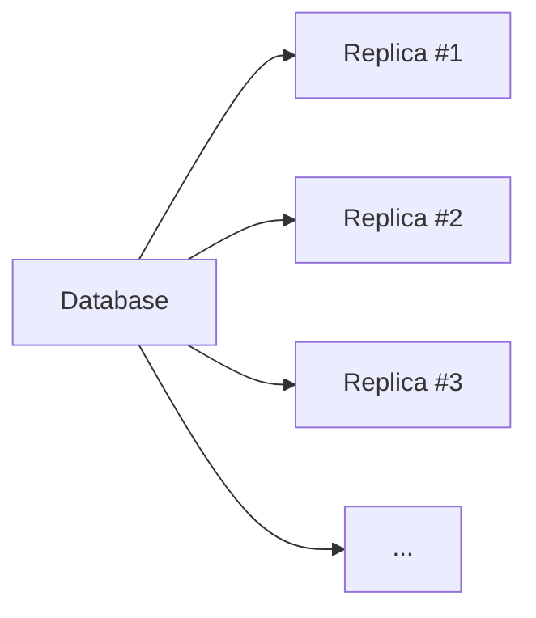
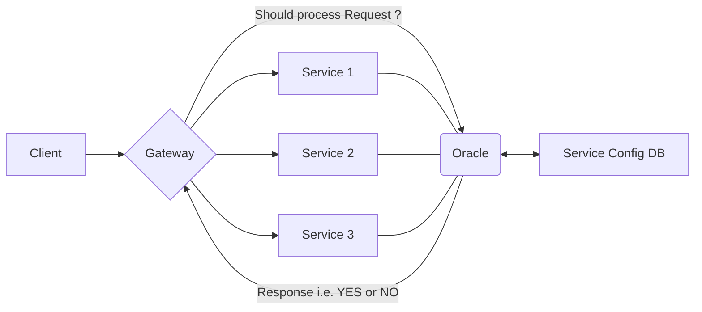
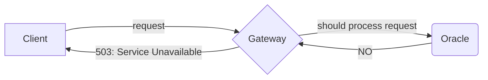

# System Design

## Basics / Prerequisites

- [System Design Basics](https://www.youtube.com/watch?v=xpDnVSmNFX0&list=PLMCXHnjXnTnvo6alSjVkgxV-VH6EPyvoX)

## Fundamentals

### Databases: Deep Dive

#### Database vs Server

It is always better to have a separate application server to take care of the application logic thereby giving us flexibility to switch from one database to other.

#### Database vs File System

A file system which is very well structured and designed for constant reads/updates/insertions is essentially a database.

#### Can Databases be in-memory ?

Yes concept of in-memory databases do exist, but they are primarily used for caching purposes.

#### Storage and Retrieval

Algorithms used for storing data:

- In relational DB, B+ Trees are used (or log-structured merge-tree).
- Pages
- Hash Tables
- Pointers.

It is always easy to move from one database to other rather than looking deeply into one database and exploring performance issues.

How do databases read data ?

- B+ Trees they form something called "Indexes" to something called "Rows of structured data".
- Strucutured data is universally acceptable conceptually as it has standard data types for each column rescpectively.
- Hash Tables are basically meant for Faster lookups along with B+ Trees.
- There are foreign keys in this table which use pointers.

General structure of an SQL query:

```sql
select * from [TABLE_NAME] where [CONDITION] group by [COLUMN_NAME] having [AGGREGATION] order by [COLUMN_NAME] limit number;
```

**Query Optimizer** within the DBMS will look at this query and will find the most optimal way to exectue this query internally because we as developers don't know where the indexes are and how the data is stored.

#### What is a NoSQL database ?

- NoSQL databases are **document oriented databases** which store data in key-value pairs.
- Have gained a lot of popularity recently as they provide additional benefits.
- May not always be the go-to choice.
- Examples: MongoDB, ElasticSearch.

#### Are databases a single source of truth ?

- Yes Databases are expected to provide consistent data or the data which is as consistent (as recent) as possible.
- They are also responsible to be available for every incoming request.

#### What is a Database Management System ?

- Decide how and where any data is to be kept.
- Configurations when storing the data.
- Helps with read replicas and coordination in the system.

Think of a DBMS like a Manager and Employees as Tables. The manager will make sure that each employee will store the data only that they are authorized to store.

#### Graph Databases

- Stores data internally as nodes and edges.
- Used to perform graph queries efficiently.

#### Time-series DB

- Stores data that are part of time-series. Ex: No. of sales happening on per hour/day/month/year basis.
- Aggregate and compress time-stamped data.
- Since, relational databases are extremely flexible and thus, there are few time-series DB are written on top of relational DB.

#### Object Oriented databases

- Designed to work with complex data objects (Tuples).
- Are usually implemented using Relational DB. So this is simply abstration to Relational DB to write and read data quicker.
- _Limitation_: Should only go for it when is absolutely necessary and relevant to our use-case.

#### What database should you choose ?

Every database has its own trade-offs so we can either have an alternative solution in hand or go for some database that best fits a given business scenario:

- PostgreSQL offers high consistency and durability. But in terms of availability it lacks support. If a postgres instance goes down then we should have a read-replica to take it's place.
- Cassandra DB has a cluster architecture, thus offering high availability. But it lacks in terms of consistency. It offers high fault-tolerance (high durability).
- Neo4J is highly efficient for graph related queries but definitely not a good choice for aggregated queries.

In summary:

- Choice of database depends on the business requirements, i.e. on the application we are writing.
- If we're unsure of how our application will grow then we should choose a database that we're most familiar with.
- If we have enough idea of how the application works currenly, we choose the database that gives us the best trade-offs.

### Consistency in Distributed Systems

#### What is Data Consistency ?

Consistency is a **measure** of how **UP TO DATE** the data in a _distributed system_ is.

Two terms:

- **String Consistency** when the data we fetch reflects all the updates done on this piece of data.
- **Weak Consistency** when the data we fetch, is actually stale (old), without or with partially complete recent updates.

**Why is consistency important ?**

1. Strongly consistent system are **easier to understand** because all of the updates are reflected in all of the data in the system.
2. **User Experience** Users appreciate their changes being reflected (e.g. liking a post).

As an engineer, it is our responsibility to make our system as consistent as possible.

#### Levels of Data Consistency

##### Linearizable Consistency

This is the highest level of consistency.

A Read operation will result in the **MOST UP TO DATE** data.

Although life is not so simple, and Linearizable Consistency has its own drawbacks.

But, **How can we reach such a high level of consistency ?**

Concept of FCFS, i.e. to **force ordering** in all the requests received. This guarantees that every request will be processed in sequence.

**Head of Line Blocking**: One of the requests could be a complex one and will therefore take reasonably more time to get executed. This is where the system stops responding and is therefore a **single point of failure**.

So two issues arise:

1. **High Latency** (Latency here means the time taken to process requests successfully starting from the time they had to wait in the queue to get processed) The wait times of each request could be so high that the overall latency of the system is increasing.

2. **Low Availability** (Availability here means the chance for a server to be able to respond to a request). It is possible for a request to never reach the server for process as it would always be stuck in queue. Hence, it will be assumed that the system is dead and such a system is called an unavailable system.

**Implementation**:

1. **Single Thread** A single threaded application would ensure that all request process in-order.
2. **RAFT protocol** ensures that ordering is maintained accross the distributed system.

##### Eventual Consistency

Consider a scenario where the following order of requests arrive in the system:

1. `write(1, 21)`
2. `read(1)`

Now, in a distributed scenario where there could be multiple services listening to the requests or the database itself could be multi-node to handle operations in parallel. Hence, there is a possibility that the read request could get executed first before the write request. This means that there exists Out-of-Order requests.

While this could be a problem in some applications but in some other applications this turns out to be perfectly fine.

_Example_: Gmail. As we sent an email, it may be visible in Outbox for sometime but we are assured that it will be delivered.

##### Causal Consistency

Causal Consistency is about _Cause_ and _Effect_.

Consider the below list of operations:

1. `read(1)`
2. `write(2, 7)`
3. `read(2)`
4. `write(1, 31)`
5. `read(2)`
6. `write(2, 17)`
7. `read(1)`

Let's say we are a client with ID = 1, and we are concerned with only the operations with ID = 1. Now, if initial value of 1 is 21 (say) then for Req #1 and Req #7, the response that we are expecting is 21 and 31 respectively.

But, if we apply Linearizable Consistency here, than Req #7 will be blocked due to all possible requests before it. Irrelevant Reqs. #2, #3, #5, #6 will be blocking Req #7. This is wastage of resources. Not only that, what if Req. #5 or Req #6 fails, than Req #7 will be blocked due to a cause which has no relevance to it.

**Soultion**:

Extract the requests which are associated with the same key but in that same order.

| #1             | #2             |
| -------------- | -------------- |
| `read(1)`      | `write(2, 7)`  |
| `write(1, 31)` | `read(2)`      |
| `read(1)`      | `read(2)`      |
|                | `write(2, 17)` |

Let's say thread #1 takes a global lock on key 1:

- Even if `write(1, 31)` comes at the same time as `read(1)`, it will be blocked.
- All the following operations will hold and release the lock in that order.

This is Causal Consistency. If we are somehow related to an operation before us, than those operations have to be executed before you. In short, _After there is **Cause** there is **Effect**_.

What if even thread #2 takes a global lock on Key 2:

- If `read(2)`, `read(2)` and `write(2, 17)` concurrenlty find for the lock and say `write(2, 17)` gets the lock first, then `read(7)` and `read(7)` would show 17 instead of 7.

Only, if all of them get the lock sequentially then its fine otherwise we have a problem.

Thus, in Causal Consistency we focus on **Ordering rather than Locking**.

**Summary**:

- Causal consistency is a higher level consistency than Eventual Consistency because here we are guaranteed than all requests on same key will be executed sequentially.
- It is more efficient than Linearizable consistency because here we are not waiting for all the operations to execute before the current operation. We are basically waiting only for a subset of operations over the same key before executing the current operation.

**Drawback**:

What is the drawback of Causal Consistency ?

Problem arises in the case of aggregated queries. Suppose all read requests are replaced with `sum`.

- `sum`
- `write(2, 7)`
- `sum`
- `write(1, 31)`
- `sum`
- `write(2, 17)`
- `sum`

Then according to causal consistency, we'll do as follows:

| #1  | #2           | #3           |
| --- | ------------ | ------------ |
| sum | write(2, 7)  | write(1, 31) |
| sum | write(2, 17) |              |
| sum |              |              |
| sum |              |              |

Now, all these three threads will be executed parallely and all the operations assigned to them will happen sequentially. But multiple cases may arise:

- Either all `sum` execute before `write(2, 7)` and before `write(1, 31)`
- Either all `sum` execute before `write(2, 17)` but after `write(1, 31)`
- Few `sum` operations executed after `write(2, 7)`, few after `write(1, 31)`.
- and so on...

So, we can conclude that, these operations will give different responses based on different permutations of execution.

Moreover, if the aggregate operations are based on certain range `sum(1, 2)` (say), then we'll have problems in causal ordering. Since aggregation functions use multiple keys, they cannot be ordered by a single key.

This issue is solved by the next consistency model.

##### Quorum

In this consistency, we have multiple replicas (or nodes) of the database and these replicas need not be consistent with each other. All these replicates will be queried in parallel for a READ request.



Let's say:

| ID  | Replica #1 Data | Replica #2 Data | Replica #3 Data |
| --- | --------------- | --------------- | --------------- |
| 1   | 10              | 10              | 10              |
| 2   | 20              | 20              | 20              |
| 3   | 30              | 30              | 30              |
| 4   | 40              | 50              | 40              |

So, how will a READ query work here?

Let's say we got a read query for Key #4 then, the database will query all these replicas and ask for values: (40, 50, 40) in this case. Here we can:

- Take the majority value (40 in this case).
- Take the value with the most recent timestamp (50 in this case).
- and so on...

So, there is some sort of _Concensus_ in a Distributed System through Quorum.

Now, why is this **Eventually Consistent** (in most cases)?

Every request should follow the Rule: `R + W <= N`

Let's Replica #2 after executing `write(4, 50)` crashed and then the read query for all three replicas resulted in (40, 40) as the second replica didn't respond. Finally, the reponse will be recorded as 40 (instead of 50).

Can we make this system a **Strongly Consistent** system ?

How many replicas do we have (N) = 3
How many minimum nodes do we need to write to? (W) = 1
How many read nodes are we left with? (R) = 2

Every request should follow the Rule: `R + W > N`.

So, according to this rule, R > 2 but in our response we get (40, 40); Hence, this entire request fails and system responds with an error (503).

Not only this, in a system that follows such formula, we can change the # write copies that we have.

Let's say: R = 2, W = 2 and still R + W > 3. This simply means that at least two copies have to have the latest data. Now, for a read request even if one of them crashes, either of the other two would still have the latest data.

Depending on the level of Quorum chosen, we will get

- **More Efficiency** if we go for an Eventually consistent system.
- **Fault Tolerance** if we go for a Strongly consistent system.

In short, Quorum gives us the power to have a customized balance in consistency and efficiency of the system.

**Drawbacks**:

- Quorum needs to have multiple nodes (or replicas).
- If we have even number of replicas then there is a chance of **SPLIT BRAIN** problem.
- High Cost.

#### Data Consistency Level Tradeoffs

| Level        | Consistency | Efficiency                                                                  |
| ------------ | ----------- | --------------------------------------------------------------------------- |
| Linearizable | Highest     | Lowest (Due to Head-of-Line blocking)                                       |
| Eventual     | Lowest      | Highest (We don't have to worry about the order of Read / Write operations) |
| Causal       | High        | Mostly High (Thread based)                                                  |
| Quorum       | Configuable | Configurable                                                                |

### Distributed Rate Limitting

#### The Oracle and the Timer Wheel

What is **Rate Limiting**?

It is taking the requests in proportion to how many requests we can serve.

So, every system has some capacity of requests it can handle and based on that capacity we limit the rate of incoming requests to that system.

This helps us avoid:

- Delayed Responses
- Out of Memory (OOM) Exceptions
- Resource Drought (I/O Ports might be blocked)

What is **Cascading Failure**?

Just because one system crashed because of overload, the other systems would then crash one after other when they are not able to take the incoming load. Thus the entire system collapsed.

How to avoid Cascading Failure?

If we could apply **Rate Limiting** on each system, we could avoid cascading failure.

Can we go for **Intelligent Routing**?

Routing requests to systems depending on their request processing time or the capacity of each system that we have. Practically we are not aware of these things beforehand. Also, even if we are aware of the number of requests a server can handle, even than we can't know what is the processing time of the request we have at present.

What could be some **Short Term Solutions** or **Temporary Solutions**?

- **Vertical Scaling** The System that was getting overload, we replace it with a system of even bigger capacity and processing power. Cons: Very Costly. Instead, we should try to utilize our resources efficiently.

- **Messaging Protocol** Choice of a good messaging protocol e.g. gRPC (written over HTTP 2.0). Advantage: Does not have _Head of Line Blocking_ (Job at the Head of the Queue is taking long time and rest of the jobs in the queue have to suffer). Internally all the systems have queues where incoming jobs sit and wait for their turn. So gRPC provides _Multiplexing_, an asynchronous way to handle multiple requests. [gRPC: Introduction](https://grpc.io/docs/what-is-grpc/introduction/)

- **Message Compression** Messages should be compressed in a shorter format to avoid heavy traffic load in the network. Few good message compression tools are Kryo, GPB, etc.

- **Client Connections** Making a new connection for every new request we get just does not makes any sense. Both _Creating Connection_ and _Closing Connection_ would involve unnecessary traffic in the system. For example, in Chat Messaging system once a connection is establised, we should keep the connection for some time limit (say 1 hour) and then only we should close the connection. This makes the system faster and further helps reducing the load in the system.

- **Reduced Fan-Out** (Pull/Push Hybrid Model) Imagine a celebrity posting a new video on the internet and in that case, the system has to notifiy all the followers about this. If we have a million followers, then sending out a million messages to each follower will bombard the system with unnecessary load. Instead we, ask each client (follower) to _PULL_ the request (messages) from the sever. Ref: [Instagram System Design](https://www.youtube.com/watch?v=QmX2NPkJTKg&list=PLMCXHnjXnTnvo6alSjVkgxV-VH6EPyvoX&index=23)

- **Graceful Degradation** The system degrades but the users are not so concerned. Features like _Delivery Receipt_ and _Read Receipt_ put a heavy load on the system as for every activity a certain action is performed by the system. These functionalities are not _criticial_ to a messaging system and hence should be avoided in the case whenever the system is under tremendous load. A single acknowledement receipt would do good in this case.

Now, what is the **Long Term Solution** ?



- A **Gateway** accepts all incoming requests and routes the requests to either of **Service 1**, **Service 2** or **Service 3**.

- Each Service will have a Queue wherein all the requests will sit and wait for their turn to be processed. Services will fetch each requests from their respective queues.

- We have decoupled the configuration specific tasks of our entire system onto the **Oracle**. This is basically our _Load Balancer_ as well as our _Heart Beat Monitor_. In production application, this could be a bundle of even more responsibilities. The job of Oracle is to tell us whether an incoming request from the Gateway, in some format say: `shouldProcess(serviceId, requestObject)`, should be processed or not.



- But how does the Oracle know whether a service is available or not? Each service initially, at its startup time, would send a registration request to the Oracle say: `register(serviceId, capacity)`, wherein the service would specify the maximum number of requests it can handle at any given point of time, and the Oracle saves this information in config DB.

How to implement a **Rate Limiter** ?

Original Approach: **Sliding Window Approach**

Approach: Go through the time stamps and only allow the maximum number of requests per minute.

Algorithm:

Maximum requests per minute = K.

1. For a minute (in a time span of 60 seconds), whatever requests have arrived consider them.
2. As, soon as the second minute begins (i.e. between 61st second to 120th second), now _start_ index should be = _current time stamp_ - 60.
3. At any given time, all the requests <= _start_ index will have to kicked out of the queue (because they have reached their expiry).
4. If the number of requests in the current sliding window exceeds K, then we need to kick-out the most-recent request. This should be done only after Step 3.

This approach is not space efficient:

- **Memory Footprint**: At most K requests have to be kept in memory always (along with their timestamps).
- **Garbage Collection**: Each time we reach a new time stamp, we need to find out the requests which are no longer valid.

Best Approach: **TIMER WHEEL**

Algorithm:

- The size of this wheel (_no of buckets_) = the _Timeout_ of incoming requests in our system. For example, if _no of buckets_ = 6, then after 6 seconds, all requests have to timeout.
- Each of these buckets has a limited number of requests (_max requests per second_) it can store (basically a Queue). So, if at a _current time_, the number of requests are more than _max requests per second_, then, the last request in that order should be kicked out.
- Any request, at the _current time_ has to be sent to the bucket = _current time_ % _no of buckets_).
- Once, the _current time_ pointer moves to a bucket, first of all, if there are any existing requests in that bucket they have to be forcefully kicked out, as they have now reached their expiry time (otherwise they would have been processed), and then only new requests are pushed.
- In case, a request has been processed, the server will also remove it from the timer wheel.

Limitations:

- There could be tasks which are computationally heavy and will require more time. But, the longer the _Timeout_, the longer will be the _no of buckets_ and hence there will be longer gaps between the requests actually processed so server will be mostly idle while the timer is still busy. This is a rare case, but can be solved with a Hierarchical Timer wheel.

This long term solution along with the Timer Wheel is good enough for all the external requests. But what about internal requests? What if Service 1 wants to talk to Service 2? This is what we discuss in next section.

#### Partitioning and Real Life Optimizations

Going for an optimistic approach, we can go for a _Service Level Agreement_ with a configuration that it can handle at most N (say 20) requests at a time from the internal services.

The second thing we can do is to **Rate Limit** in the service itself. It is always better to have rate limitting measures in the service itself; so that in worst case scenario, the service will know how to handle any incoming load.

##### But, how do we identify that we are under tremendous load ?

There are few key metrics used to identify this scenario:

- Checking **Average Response Time** If this value goes high, then it either means that the service is down or it is under tremendous load.
- Checking **Age of messages in queue** If the value goes higher than the usual number, than it means that the server is under tremendous load.
- **Dead letter queue** It is a concept where all the requests that fails or could not be processed, will be pushed and respective failure messages will be sent to the subscribers of this queue. This is simimar to a _Message Queue_ service like Kafka, RabbitMQ, etc. If the size of the dead letter queue is spiking up, then it means that the service is failing a lot of requests.

These three metrics will tell us if we have a rate limiting problem going on.

##### How do you deal with Bad Actors ?

We have a queue of size 5 (say) and it has some requests in order {1, 2, 3, 4, 5}. Now, the request = 4 is some request from an external user or from a genuine service, while, requests (1,2,3,5) are from a bad actor (say S2). Now, how do we contain the requests from S2 because it's a bad actor.

We'll take the queue and partition it into pieces (# pieces = size of queue) of size 1 and whenever we get a request, we hash this:

                hash(requestId) % 5.

Now, the beauty of such an hash function would be that if a bad actor like S2 sends a request, they all would hash to the same box. So, all requests that S2 sends (1,2,3,5) will all hash into the same box and collide with each other, which means, our genuine requests would process without any issues.

Also, each of these boxes are again FIFO queues in itself and in a real system, the sizes of each such queue will again be much larger. Also, this means that in a real system 20% of the genuine requests would still be affected as they would hash to the same bucket as that which any request from a bad actor would hash.

Now, again, to mitigate such a problem, we can go for even larger # partitions i.e. increase the number of queues we have.

At last, we can also try for a hybrid queue wherein, the queue which is bombarbed by requests from Bad actor can be further divided into sub-queues with each having their own separate hash functions (h2, h3, ...)

In Summary we can:

- Increase the no. of queues.
- Increase the size of queues.
- Split the overloaded queues.

Another good application to such a partitioning concept is that we can divide the requests based on the type of tasks that follow. Remember, that the **head of line blocking** also applies over here, if for every queue, the first task is very expensive, then it would be a nightmare for the entire system. Poor performance, Poor response times, in general Poor experiences. So, if we can split the requests into tasks and route them based on the type of task that we are doing is far better. Thus, for example, requests of type T1 can route to Queue1, of type T2 can route to Queue2, and so on making sure that the performance is up to the mark. Also, if one type of task has failed, due to the queue requests been processed by an external service which is down, and this queue becoming completely full, then it does not hinder other requests as the other queues would work fine.

##### Real world optimizations

**1. Request Collapsing**

Suppose there are multiple clients requesting the same resource from the server. Now, we don't want to hammer the server each time for the same request. Caching is the solution.

NOTE: Caching here is assumed to be at the global level (ex. Redis). (The reasoning for global cache was discussed in one of YT videos).

We need to see that whenever we have a cache miss, we can store this request (what was requested from the client):

         Map < AVG_OF_EMP_SAL, Future >

Here, Future (from Java) signifies that when the resources asked have been received (e.g. avg of employee salaries) then only this request will be marked as completed.

NOTE: All this caching has to be done at the _Database Client_.

So, ONE REQUEST and ONE RESPONSE can help us minimizing database queries which are computationally heavy.

**1.1. Request Batching (or Request Condensing)**

Whenever we have a cache miss, we don't hit the backend immediately, we instead wait for few seconds and see if we get any other (not necessary a duplicate) requests, then the database client will condense these requests into a single `SELECT` statement.

In one hand where Request Collapsing is always useful, on the other hand, Request Condensing may or may not be useful as it depends on whether we want our application to process requests in batch or not.

**2. Client Side Rate Limitting**

The goal is to take the responsiblity onto the client side.

1. In case of an error response received from the Server, identify the type of this error response and then proceed further.

- If the error is of type _PERMANENT_, it means that we have a mistake in the request itself. Example, if password is incorrect, then don't retry.
- If the error is of type _TEMPORARY_, it means that the server had some internal issues, here, we should retry.

2. Don't hammer the server immediately. In some situations, server may be under tremendous load and won't process your request.

The concept of **Exponential Backoff**: When the client sends the first request, and the server responds with a timeout. In that case, the client waits for 2 seconds and sends another request. Again, the server sends a timeout error, then the client will wait for 4 seconds this time before it can send another request. We can have a maximum limit say 10 seconds, this is the maximum the client will wait after which the client will _fail_ the request, giving the server some time to recover.

**Summary**:

- Use a Global service to make sure whether a request should / should not be accepted.
- Use Global caches to make sure unnecessary request don't always hit the servers.
- Use _Timer Wheel_ (which are a variation of Token Buckets) which will limit the rate of requests falling into our server at any given point of time.
